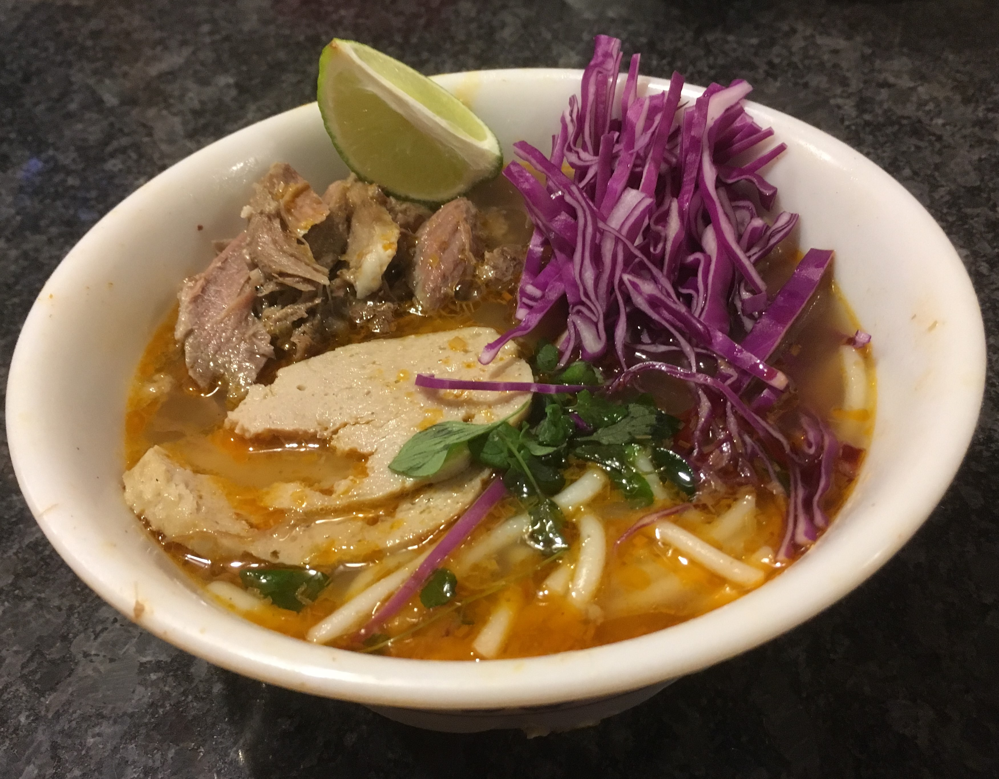
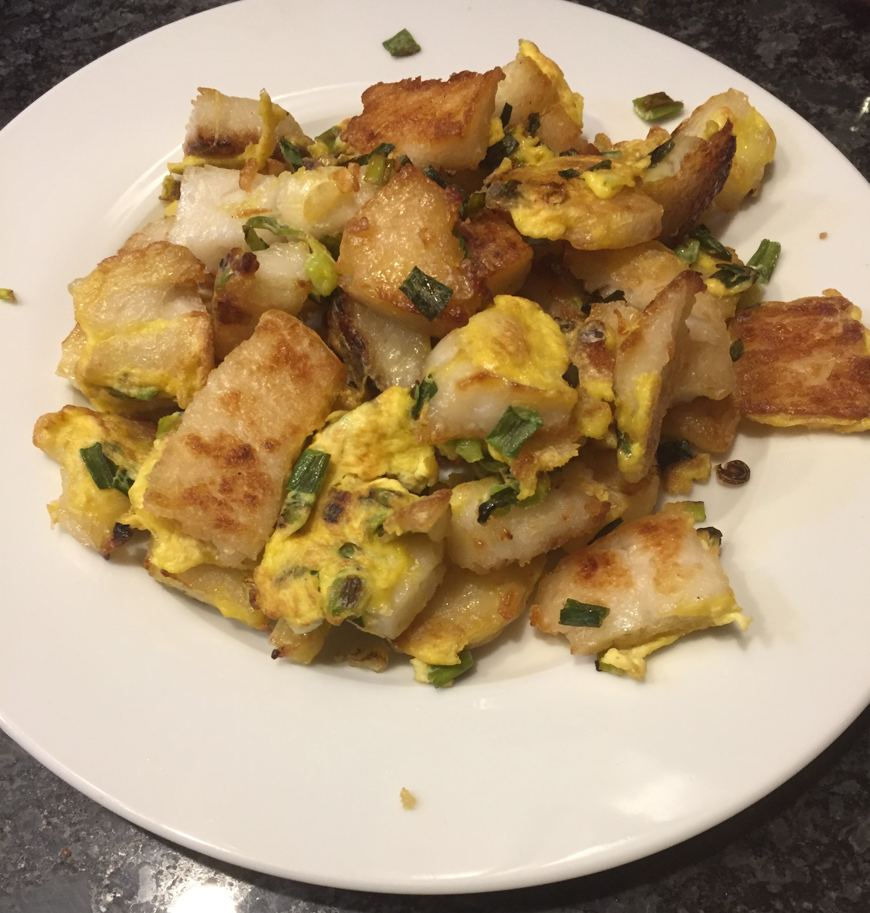

# Vietnamese {.unnumbered #viet}

This section is dedicated to Vietnamese recipes.

## Soups {.unnumbered}

### Bun bo hue {.unnumbered #bohue}

{width=80%}

Bun bo hue is a wonderful alternative for those of you tired of pho. It includes both beef and pork in a sweet and savory broth flavored with pineapple, lemongrass, and shrimp paste. While it feels very meat indulgent this recipe easily provides 8 or more servings at `~1/2` pounds of meat (most of which is lower carbon footprint pork). The seasoning can be amped up a notch by adding a dollop of the spice mix to each bowl.

 

::::: {.blackbox data-latex=""}

**Ingredients** (6-8 servings)

:::: {style="display: grid; grid-template-columns: 30% 30% 30%; grid-column-gap: 10px;"}

::: {}
For the broth:

- 1 large pork bone with some meat attached (or clean pork bones and `1/4 pound` of pork shoulder)
- 1 large beef bone with some meat attached (or clean beef bones and `1/4 pound` of chuck roast)
- 1 tbsp salt
- 1 tbsp sugar
- 1 can pineapple slices (with juice)
- 1 large yellow onion
- 4 stalks lemongrass or `1/8 cup` chopped frozen lemongrass
- 8-10 cups water
- 2 tbsp shrimp paste
- 2 tbsp spice mix
:::

::: {}
For the spice mix:

- `1/8 cup` chopped lemongrass
- `1/8 cup` minced shallots
- `2 tbsp` minced garlic
- `1 tbsp` annatto seeds
- `5 tbsp` vegetable oil
- 1 package bun bo hue dry spice powder 
:::

::: {}
For the soup:

- broth
- spice mix
- beef and pork from making broth (shredded)
- vietnamese ham, sliced thin
- 2 packages bun bo hue noodles (thick rice noodles)
- `1/4` of a red cabbage, thinly sliced
- wedge of lime
- bunch of mint
- bunch of thai basil, bean sprouts, sliced banana blossom (optional)
:::

::::

:::::

 

<!--

Hu tieu

Pho

Bo kho

Pickled mustard green soup

Rau muon

-->

## Noodles and Rice {.unnumbered}

<!--

Bun with calamari and fried shrimp.

Bun thit nuong with eggrolls.

Fried Rice

-->

### Bot chien {.unnumbered #botchien}

{width=80%}

Bot chien is a Vietnamese street food consisting of pan-fried rice cakes in a simple egg omelet. Traditionally pan-fried with LOTS of lard, we've worked up a lower grease recipe that still provides the wonderful crisp exterior and soft interior that makes this dish so craveable. This recipe is vegetarian, and is filling and satisfying enough that I've never once heard complaints about there not being any meat.

 

There are 3 components to this dish: the **rice cake**, the **omelet**, and the **sauce**. In many cities you can find pre-made rice (or taro, which works just as well) cakes at an Asian market. However, the rice cakes are simple to make from home if you can't buy them. You just need a large steamer and a heat safe dish that fits inside said steamer.

::::: {.blackbox data-latex=""}

**Ingredients** (recipe serves 2-3 people)

:::: {style="display: grid; grid-template-columns: 30% 30% 30%; grid-column-gap: 10px;"}

::: {}
For the rice cake:

- 2 cup rice flour
- 2 tbsp tapioca starch
- 1 tbsp sugar
- 2 tsp oil
- 1 tsp salt
:::

::: {}
For the omelet:

- 2-3 eggs
- 1/2 bunch green onions
:::

:::{}
For the sauce:

- 1 cup soy sauce
- 1/2 cup sugar
- 1/2 cup white vinegar
:::

::::

:::::

 

1. To make the rice cake combine all ingredients in a large, heat-safe, microwavable bowl. Microwave for 2 minutes then carefully stir, scraping the sides of the bowl. Continue microwaving for ~1 minute intervals, stirring afterwards, until mixture resembles slightly lumpy (and gummy) mashed potatoes. 

2. While still warm gently press the mixture into a greased heat-safe casserole dish, Then place inside a large steamer and steam for ~25 minutes until firm and a toothpick inserted in the center comes out mostly clean. (If doubling the recipe increase steaming time.) 

3. Allow the rice cake to cool for at least a couple hours.^[You can make these days in advance, but they do not freeze/thaw well so keep them in the fridge.] 

4. While the rice cake is cooling make the sauce by heating the soy sauce, sugar and vinegar in a small sauce pan until the sugar dissolves and the mixture begins to bubble. Remove from the heat and allow to cool. (You can store this sauce at room temperature in a sterile glass jar.) 

5. When the rice cake is cool cut it into `~ 2 inch X 2 inch X 1/4 inch` thick slices. 

6. Beat the eggs and chop the green onions into small pieces.

7. Now it's time to pan-fry the rice cakes. This really needs to be done in small batches or the rice cakes won't crisp up. Heat a teaspoon of oil in a large non-stick skillet and add as many slices of rice cake as will comfortably fit in a single layer in your pan. Once the cakes begin to show a golden-carmel brown color on the bottom flip them over and add a handful of green onions and one more teaspoon of oil to the pan. Once the cakes are crisped on both sides add some of the beaten eggs and fry until the eggs are just cooked through. 

As a "shortcut", particularly if you plan on making this for more than 2 people, I recommend doing an initial cook of the rice cakes on large sheet pans in the oven. Liberally oil a large sheet pan, lay the rice cakes down in a single layer, then bake (use convection or "air-fry" mode if you have it) for 10-15 minutes per side at 525 degrees F. (The goal is to get the crisping started without drying the rice cake out.) You can then quickly finish the cakes with the green onion and egg in the skillet.

Serve the rice cakes with plenty of sauce drizzled over the top, some lime juice, and a bit of chili garlic sauce. Great with a side dish of [smashed cucumber salad](#cucsalad).

## Banh {.unnumbered}

<!--

Banh Bao

Banh Xeo

Banh mi

Banh with Char Siu pork

-->

## Meats {.unnumbered}

### Lemongrass pork {.unnumbered #lgpork}

 ***Coming Soon*** 

<!--
Carmel chicken

Sweet and sour pork

Little pork

Crispy pork belly
-->

## Extras {.unnumbered}

 ***Coming Soon*** 

- Pate

- Pickled carrots and daikon

- Eggrolls

- Special fish sauce

- Pickled mustard greens

<!--

Spring rolls with chili-lemongrass tofu

Shrimp and omelet springrolls

Peanut sauce

-->
