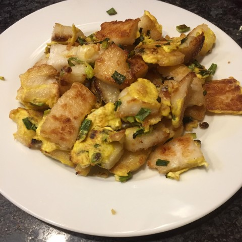

# Vietnamese {.unnumbered #viet}

This section is dedicated to Vietnamese recipes.

## Soups {.unnumbered}

### Bun bo hue {.unnumbered #bohue}

{width=40%}

Bun bo hue is a wonderful alternative for those of you tired of pho. It includes both beef and pork in a sweet and savory broth flavored with pineapple, lemongrass, and shrimp paste. While it feels very meat indulgent this recipe easily provides 8 or more servings at `~1/2` pounds of meat. The seasoning can be amped up a notch by adding a dollop of the spice mix to each bowl.

 

::::: {.blackbox data-latex=""}

**Ingredients** (6-8 servings)

:::: {style="display: grid; grid-template-columns: 30% 30% 30%; grid-column-gap: 10px;"}
::: {}
For the spice mix:

- 1/8 cup chopped lemongrass
- 1/8 cup minced shallots
- 2 tbsp minced garlic
- 1 tbsp annatto seeds
- 5 tbsp vegetable oil
- 1 package bun bo hue dry spice powder^[Make your own by combining: paprika, garlic powder, onion powder, ginger powder and chili powder.] 
:::

::: {}
For the broth:

- 1 large pork bone with some meat attached (or clean pork bones and 1/4 pound of pork shoulder)
- 1 large beef bone with some meat attached (or clean beef bones and 1/4 pound of chuck roast)
- 1 tbsp salt
- 1 tbsp sugar
- 1 can pineapple slices (with juice)
- 1 large yellow onion
- 4 stalks lemongrass or 1/8 cup chopped frozen lemongrass
- 8-10 cups water
- 2 tbsp shrimp paste
- 2 tbsp spice mix
:::

::: {}
For the soup:

- broth
- spice mix
- beef and pork from making broth (shredded)
- vietnamese ham, sliced thin
- 2 packages bun bo hue noodles (thick rice noodles)
- 1/4 of a red cabbage, thinly sliced
- wedge of lime
- bunch of mint
- bunch of thai basil, bean sprouts, sliced banana blossom (optional)
:::

::::

:::::

 

1. Make the spice mix by heating oil in a small skillet. Add the annatto seeds and fry until fragrant and the oil takes on a reddish color (be careful to not burn the seeds).^[This can be rather messy and will stain your clothes so don't do this while wearing nice clothes.] Remove the annatto seeds from the oil and add the minced garlic and shallots to the oil. Fry for a couple minutes until fragrant then add the chopped lemongrass and dry spice powder. Keep on the heat for a couple minutes more until you have a thick, fragrant red paste.

2. Start the broth by cooking the bones and meat in `~8-10` cups water with salt and sugar until the meat is tender and easily pulls off the bone (about one cycle on "soup" setting in our InstantPot).

3. Remove the meat and set aside. Put the bones back to the water and add a can of pineapple, a whole, peeled yellow onion; and lemongrass stalks or chopped lemongrass. Cover the pot and simmer for at least an hour (or another cycle in the InstantPot).

4. Add shrimp paste and spice mix to the broth then season with salt and sugar as needed.

5. Pour boiling hot broth through a strainer over each prepared bowl of rice noodles, cabbage, herbs, shredded meat, and sliced ham. Serve with a squeeze of lime and a dollop of the spice mix in each bowl.

****

### Hu tieu {.unnumbered #hutieu}

{width=40%}

Hu tieu, or hu tieu nam vang, is a pork and onion soup served with roast red pork, and sometimes, seafood. Less well known than pho, this Vietnamese version of onion soup is a household favorite.

 

::::: {.blackbox data-latex=""}

**Ingredients** (6-8 servings)

:::: {style="display: grid; grid-template-columns: 30% 30% 30%; grid-column-gap: 10px;"}

::: {}
For the broth:

- 2 large pork bones 
- 1 tbsp salt
- 1 tbsp sugar
- 1 yellow onions (roasted)
- 4 cloves garlic (roasted)
- 1-2 carrots
:::

::: {}
For the roast red pork:

- 1 pound pork shoulder
- 3 tbsp Chinese barbeque char siu seasoning powder^[Make your own by combining: five spice powder, granulated garlic, paprika, red pepper flakes, chili powder, cayenne, brown sugar and salt.]
:::

::: {}
For the soup:

- broth
- red pork
- boiled shrimp (optional)
- chinese celery
- green onions
- fried minced garlic
- rice noodles (pho noodles) or ramen style noodles
:::

::::
:::::

 

1. For the roast red pork first slice the pork shoulder into `1/2` inch thick slices then sprinkle with the red pork seasoning and water, mix well, then let marinate for ~30 minutes.

2. Roast the pork slices at 400$^\circ$ for ~30 minutes, turning the slices over after 15 minutes. Slice the pork into bite-sized pieces.

3. Start the broth by simmering the bones in `~8-10` cups water with salt and sugar  for ~1 hour (about one cycle on "soup" setting in our InstantPot).

4. At the same time peel the whole onions and roast at 425$^\circ$ for at least 45 minutes or until browned and the juices are starting to carmelize. Add the whole garlic cloves to the onion roasting pan after ~30 minutes (they will burn if you do them the full time).

5. Add the roasted onions and garlic to the broth and simmer for at least 1 more hour (or another cycle on the InstantPot) then season with fish sauce and sugar to taste.

6. Pour boiling hot broth through a strainer over each prepared bowl of noodles, chopped celery^[Chinese celery, which has thinner stalks and more leaves, is preferred, but normal celery works as well], green onions, red pork and boiled shrimp. Serve with a bit of fried minced garlic on top.

****

### Pho {-}

 ***Coming Soon*** 

<!--

Bo kho

Pickled mustard green soup

Rau muon

-->

## Noodles and Rice {.unnumbered}

<!--

Bun with calamari and fried shrimp.

Bun thit nuong with eggrolls.

Fried Rice

-->

### Bot chien {.unnumbered #botchien}

{width=40%}

Bot chien is a Vietnamese street food consisting of pan-fried rice cakes in a simple egg omelet. Traditionally pan-fried with LOTS of lard, we've worked up a lower grease recipe that still provides the wonderful crisp exterior and soft interior that makes this dish so craveable. This recipe is vegetarian, and is filling and satisfying enough that I've never once heard complaints about there not being any meat.

There are 3 components to this dish: the **rice cake**, the **omelet**, and the **sauce**. In many cities you can find pre-made rice (or taro, which works just as well) cakes at an Asian market. However, the rice cakes are simple to make from home if you can't buy them. You just need a large steamer and a heat safe dish that fits inside said steamer.

::::: {.blackbox data-latex=""}

**Ingredients** (recipe serves 2-3 people)

:::: {style="display: grid; grid-template-columns: 30% 30% 30%; grid-column-gap: 10px;"}

::: {}
For the rice cake:

- 2 cup rice flour
- 2 tbsp tapioca starch
- 1 tbsp sugar
- 2 tsp oil
- 1 tsp salt
:::

::: {}
For the omelet:

- 2-3 eggs
- 1/2 bunch green onions
:::

:::{}
For the sauce:

- 1 cup soy sauce
- 1/2 cup sugar
- 1/2 cup white vinegar
:::

::::
:::::

 

1. To make the rice cake combine all ingredients in a large, heat-safe, microwavable bowl. Microwave for 2 minutes then carefully stir, scraping the sides of the bowl. Continue microwaving for ~1 minute intervals, stirring afterwards, until mixture resembles slightly lumpy (and gummy) mashed potatoes. 

2. While still warm gently press the mixture into a greased heat-safe casserole dish, Then place inside a large steamer and steam for ~25 minutes until firm and a toothpick inserted in the center comes out mostly clean. (If doubling the recipe increase steaming time.) 

3. Allow the rice cake to cool for at least a couple hours.^[You can make these days in advance, but they do not freeze/thaw well so keep them in the fridge.] 

4. While the rice cake is cooling make the sauce by heating the soy sauce, sugar and vinegar in a small sauce pan until the sugar dissolves and the mixture begins to bubble. Remove from the heat and allow to cool. (You can store this sauce at room temperature in a sterile glass jar.) 

5. When the rice cake is cool cut it into `~ 2 inch X 2 inch X 1/4 inch` thick slices. 

6. Beat the eggs and chop the green onions into small pieces.

7. Now it's time to pan-fry the rice cakes. This really needs to be done in small batches or the rice cakes won't crisp up. Heat a teaspoon of oil in a large non-stick skillet and add as many slices of rice cake as will comfortably fit in a single layer in your pan. Once the cakes begin to show a golden-carmel brown color on the bottom flip them over and add a handful of green onions and one more teaspoon of oil to the pan. Once the cakes are crisped on both sides add some of the beaten eggs and fry until the eggs are just cooked through. 

As a "shortcut", particularly if you plan on making this for more than 2 people, I recommend doing an initial cook of the rice cakes on large sheet pans in the oven. Liberally oil a large sheet pan, lay the rice cakes down in a single layer, then bake (use convection or "air-fry" mode if you have it) for 10-15 minutes per side at 525$^\circ$ F. (The goal is to get the crisping started without drying the rice cake out.) You can then quickly finish the cakes with the green onion and egg in the skillet.

Serve the rice cakes with plenty of sauce drizzled over the top, some lime juice, and a bit of chili garlic sauce. Great with a side dish of [smashed cucumber salad](#cucsalad).

****

## Banh {.unnumbered}

### Banh Xeo {- #banhxeo}

{width=40%}

Delicious savory crepes. A classic Vietnamese street food reinterpreted for a home-cooked dinner. Serve with [Special Fish Sauce](#fishsauce).

 

:::: {.blackbox data-latex=""}

**Ingredients** (~6 servings)

::: {}
- 2 cups rice flour 
- 1 Cup corn starch 
- 2 teaspoons turmeric 
- 1 tablespoon sugar 
- 1/4 teaspoon baking soda 
- 1 Cup finely chopped green onions 
- 1 Cup coconut milk 
- 1/2 Cup yellow mung beans or split piece (softened in warm water )
- 4 cups water 

- 1/2 pound shrimp 
- 1/2 pound ground pork or chopped pork shoulder 
- 1 teaspoon black pepper 
- 2 teaspoons sugar 
- 1 to 2 tablespoons fish sauce 

- lettuce
- herbs (mint, thai basil)
- bean sprouts

:::
::::

 

1. Marinate pork in two TSP sugar, black pepper and fish sauce for 10 to 15 minutes then cook on medium until starting to brown and caramelize.
2. Boil shrimp in salted water until just cooked through, 2 to 3 minutes, then remove from pot. 
3. Soften the mung beans in hot water for 30 minutes to one hour then drain the liquid. 
4. Blend the softened mung beans with coconut milk in a food processor until smooth. 
5. Mix the rice flour corn starch, baking soda  and turmeric together in a large mixing bowl. Add the water, chopped green onions, and coconut milk mung bean puree and whisk together.
6. Heat a large nonstick skillet to medium heat and add 1 teaspoon oil. When oil is hot add one to 2 ladles of batter to the skillet and immediately swirl to create an even layer of batter on the bottom of the skillet. 
7. Quickly add a small amount of pork and one or two shrimp and a small handful of bean sprouts to one side of the skillet before the batter dries. 
8. When batter is dry to the touch, and the bottom is just starting to crisp and turn golden brown, fold the crepe in half (kinda like an omelet). Allow to continue cooking until bottom is crispy, then flip crepe and add 1 more teaspoon of oil to skillet to crisp the other side. 
9. Remove from heat when both sides are a deep golden brown and crispy on the edges. (Maintaining a good medium to medium-low heat and keeping the layer of batter thin is key to producing a crepe that you can fold and that is crispy.)
10. Serve crepes immediately with lettuce, herbs, and additional bean sprouts. The crepes are traditionally torn into smaller pieces and wrapped in the lettuce with the other herbs and vegetables Then dipped in special fish sauce with lime and chili garlic sauce.

****

### Banh Mi {- #banhmi}

{width=40%}

::::: {.blackbox data-latex=""}

**Ingredients** (recipe serves 2-3 people)

:::: {style="display: grid; grid-template-columns: 30% 30% 30%; grid-column-gap: 10px;"}

::: {}
For the ham:

- 2 lbs ground pork (fine ground if available)
- 2 tbsp tapioca starch
- 4 tbsp fish sauce
- 1 tbsp sugar
- 1/2 tbsp MSG (if available)
- 3 tsp baking powder
- 1/2 cup water

:::

::: {}
For the pate:

- ground pork
- chicken liver
- garlic cloves
- salt
- pepper

:::

:::{}
For the sandwich:

- baguettes
- pickled carrots and daikon radish
- cilantro
- cucumber
- mayo and cilantro

:::

::::
:::::

Make the ham:

1. Mix baking powder with water then add to the ground pork and mix well. Refrigerate for ~6 hrs.

2. Add fish sauce, sugar, MSG and pepper to pork mixture then beat in a stand mixer for ~10 minutes until very smooth and tacky.

3. Rinse and dry some ~6 inch wide strips of banana leaf. Place a blob of pork mixture in the middle of a piece of banana leaf, roll into a cylinder, and fold the ends over. Then tightly wrap in plastic wrap to seal.

4. Steam the rolls in a large stovetop steamer for ~20 minutes. The cooked ham rolls should be firm and bouncy. Cooked ham rolls freeze well for extended storage.

Make the pate:

****

## Meats {.unnumbered}

### Lemongrass pork {.unnumbered #lgpork}

 ***Coming Soon*** 

<!--
Carmel chicken

Sweet and sour pork

Little pork

Crispy pork belly
-->

## Extras {.unnumbered}

 ***Coming Soon*** 

- Pate

- Pickled carrots and daikon

- Pickled mustard greens

- Eggrolls

### Special fish sauce {- #fishsauce}

The classic Vietnamese condiment and dipping sauce. A household staple.

 

:::: {.blackbox data-latex=""}

**Ingredients** (~6 servings)

::: {}
- 3/4 Cup sugar 
- 1/2 Cup vinegar 
- 1/2 Cup fish sauce 
- 2 cups water 

:::
::::

 

Combine all ingredients in saucepan and heat on medium heat until sugar has dissolved and liquid begins to bubble. Remove from heat. Can be stored in a sterile glass jar at room temperature. Add fresh squeezed lime juice and a dollop of chili garlic sauce two a small bowl of fish sauce before serving. 

****

<!--

Spring rolls with chili-lemongrass tofu

Shrimp and omelet springrolls

Peanut sauce

-->
