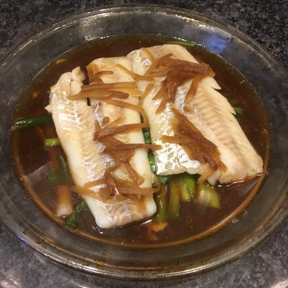

# Other Asian {.unnumbered}

## Chinese {.unnumbered}

### Ma po tofu {.unnumbered #mapotofu}

 ***Coming Soon*** 

### Ginger fish {.unnumbered #gingerfish}

{width=40%}

### Smashed cucumber salad {.unnumbered #cucsalad}

 ***Coming Soon*** 

### BBQ Pork Buns {.unnumbered #bbq}

{width=40%}

Sauted bok choy in white sauce

Veggie Lo Mein

Rice noodle stir fry

Hot and sour soup

### Egg drop soup {- #eggdrop}

The classic side-dish. Super easy to make.

:::: {.blackbox data-latex=""}

**Ingredients** (~4 servings)

::: {}
1 1/2 tbsp cornstartch
3 tbsp chicken bouillon powder
1/2 tsp ground ginger
1/4 tsp granulated garlic
3 1/3 cups water
2 eggs (beaten)
1/2 tsp sesame oil
chopped green onion
:::
::::

 

1. In a small pan mix the cornstartch, bouillon, ginger and garlic.

2. Slowly add the water to pan while stirring to dissolve the cornstartch.

3. Heat on medium, stirring occasionally, until the broth simmers. The broth should be slightly thickened at this point.

4. Reduce the heat to low then slowly add the beaten eggs while stirring constantly (but gently). 

5. Remove from heat and add sesame oil and chopped green onions. 

## Japanese {.unnumbered}

Curry buns

White bean paste buns

Tatamen Spicy Ramen

Tonkatsu Pork Ramen

Miso

Fried Shrimp and Calamari Sushi

## Korean {.unnumbered}

### Bibimbap with crispy rice {.unnumbered #crispyrice}

{width=40%}

Jap chae

Leftover pancakes

## Thai {.unnumbered}

Coconut curry

Pad Thai

