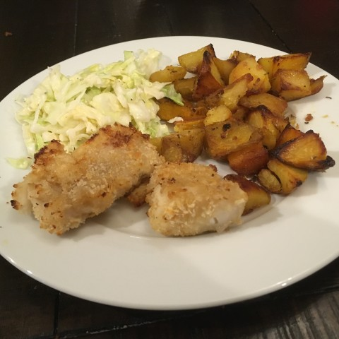
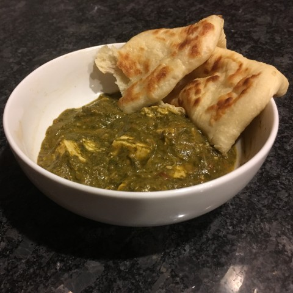
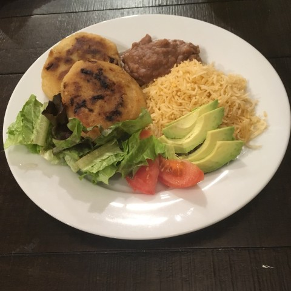
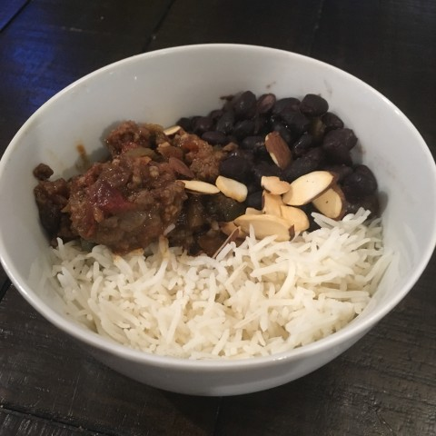

# Other Savory Dishes {.unnumbered}

## American {.unnumbered}

### Falafel burgers {.unnumbered #burger}

{width=40%}

Contributed by *Tuan Nguyen*

A wonderful, juicy burger with half the meat.

 

:::: {.blackbox data-latex=""}

**Ingredients** (4-5 servings)

::: {}

- 2/3 cup powdered falafel mix
- 1/4 cup water
- 1/2 onion
- ~1/4 cup breadcrumbs
- 1 egg (beaten)
- 1 lb ground beef
- seasonings (smoked paprika, granulated garlic, red pepper flakes, salt, black pepper,MSG)

:::

::::

 

1. Mix water with falafel powder. Add egg, breadcrumbs, and seasonings to taste and mix until well combined.

2. Add the onion and ground beef and gently fold into the falafel mixture.

3. Form into patties and grill.

### Hot chicken {.unnumbered #hotchicken}

{width=40%}

We used to crave hot chicken from Nashville-located Hattie B's. Not anymore.

 

::::: {.blackbox data-latex=""}

**Ingredients** (6-8 servings)

:::: {style="display: grid; grid-template-columns: 30% 30% 30%; grid-column-gap: 10px;"}
::: {}
For the spice mix:

- 1 tbsp paprika
- 1/2 tbsp smoked paprika
- 1 tbsp chili powder
- 1 tbsp cayenne

:::

::: {}
For the batter:

- 2 cups all-purpose flour
- 4 tbsp spice mix
- 2 tsp baking powder
- 1 tbsp salt
- 1 tbsp black pepper

- 2 eggs (beaten)
- 1 1/2 cup buttermilk
- 3 tbsp hot sauce

:::

::: {}
For the marinated chicken:

- 3 lbs chicken breast
- 3 cloves garlic (smashed)
- 3 tbsp hot sauce
- 1 cup pickle juice

:::

::::

:::::

 

1. Cut chicken into ~1 inch thick slices. Place in a plastic container with the marinade of pickle juice, garlic,a nd hot sauce (use a vinegar based hot sauce like tabasco). Refrdigerate for at least 2 hours.

2. Mix all dry batter ingredients in a bowl. In a seperate bowl combine all wet batter ingredients.

3. Pat chicken dry then coat in dry batter mix, dip in the wet batter mix, then coat in the dry batter mix again.

4. Fry chicken in small batches in ~2-3 inches of oil for ~6-7 minutes, turning the chicken over after ~3 minutes.

****

### Hot chicken-fried tofu {.unnumbered #hottofu}

{width=40%}

### Corn Chowder {- #cornchowder}

{width=40%}

A slightly sweet and creamy corn chowder with crab and roasted poblano peppers.

 

:::: {.blackbox data-latex=""}

**Ingredients** (~8 servings)

::: {}

- 2 cans corn
- 2 cans cream style corn
- 2 roasted poblano peppers (seeds removed)
- 2 onions (diced)
- 6 cloves of garlic (minced)
- 3 slices of bacon or salt pork (diced)
- 2 cans lump crab meat
- 1 tsp smoked paprika
- 1/2 tsp chili powder
- 1/2 tsp onion powder
- 1/2 tsp garlic powder
- 1 tsp dried thyme
- salt and black pepper
- water/milk?
:::
::::

 

1. Cook stuff.

2. Add crab.

****

<!--Home fries

Kale salad-->

### Air-fried "fish and chips" {- #fishandchips}

{width=40%}

Crispy, battered fish and crispy potatoes without the frying.

:::: {.blackbox data-latex=""}

**Ingredients** (~4-6 servings)

::: {}
- 1.5 lbs white fish (preferably cod) 
- 2 cups panko breadcrumbs
- 1/2 cup all purpose flour
- 1/2 cup corn starch
- 1 tsp baking powder
- 4 oz beer (half a bottle)
- 3 lbs yukon gold potatoes
- oil
- salt and pepper
:::
::::

<!--BBQ chicken pizza

Creamy tomato soup-->

### Butternut squash mac and cheese {- #squashmc}

{width=40%}

Contributed by *Lee Nelson*

Add butternut squash for a creamy, low(er) fat version of mac and cheese. Yay!

 

:::: {.blackbox data-latex=""}

**Ingredients** (~8 servings)

::: {}
- 2 cups peeled, diced butternut squash
- 1/2 cup milk
- 1 tbsp butter
- 3/4 cup shredded sharp cheddar
- 1/2 tsp salt
- 1/4 tsp garlic powder
- 1/8 tsp ground white pepper
- 16 oz elbow macaroni or small shells
:::
::::

 

1. Boil or steam butternut until tender, about 20 minutes. Drain if needed.

2. Cook pasta  in boiling salted water until al dente, about 8-10 minutes. Reserve 1 cup of pasta water before draining.

3. Combine the (hot) butternut, butter, milk, salt, and pepper in a blender and purée until smooth. Add the cheese and blend for 5 seconds.

4. Combine butternut cheese sauce and macaroni. Add pasta water a little bit at a time until it reaches the creamy consistency you prefer.

****

<!--Pasta salad with olives

### Pulled meat {-}-->

## Indian {.unnumbered}

### Saag paneer {- #saag}

{width=40%}

Add mustard greens and buttermilk to this classic spinach curry. 

 

:::: {.blackbox data-latex=""}

**Ingredients** (~6 servings)

::: {}
- 2 -3 Bay leaves 
- 3 green cardamon pods 
- 1 large yellow onion (diced)
- 2 tablespoons minced garlic 
- 1.5 tablespoons minced ginger 
- 2 teaspoons  ground coriander 
- 1 teaspoon ground cumin 
- 1 tablespoon garam masala 
- 1/2 tablespoon spicy Curry powder 
- 1 teaspoon chili powder 
- 1 teaspoon salt 
- 3 tbsp ground cashews
- 14 ounce can diced tomatoes 
- 1 lb fresh spinach (chopped)
- 1 lb fresh mustard greens (chopped)
- 1 cup lowfat buttermilk
- 1 lb paneer (cubed)

:::
::::

 

1. Heat oil in a large skillet. Add Bay leaves and cardamom pods And fry for one to two minutes. 

2. Add diced onion 2 pan and fry until onions are Golden Brown and crispy on the edges about 5 to 10 minutes. 

3. Add minced garlic and ginger and fry for 30 seconds to one minute until fragrant then add all spices salt and ground cashews and cook for an additional minute. 

4. Add can of diced tomatoes with juice to the pan and cook until reduced and thickend about 10 minutes 

5. Add fresh chopped spinach and fresh chopped mustard greens 2 pan with a little water.  Cover pan and let simmer on low heat until greens are softened. 

6. Add half of the buttermilk then carefully pour all contents of pan into a blender. Blend until smooth then pour back into pan. 

7. Add the remaining buttermilk and paneer that has been cut into half inch to 1 inch cubes. Cover and heat on low until mixture begins to bubble. Remove from heat and serve. 

<!--Sahi korma

Peas palag paneer-->

## European {.unnumbered}

<!-- Gazpacho -->

<!-- Tabouli -->

<!-- Caldo Verde -->

<!-- Yorkshire Pudding with Beef and Mushrooms -->

## Middle Eastern and African {.unnumbered}

<!-- Kefta -->

<!-- Doro Wat -->

<!-- Kabobs -->

## Latin American {.unnumbered}

### Papusas {- #papusas}

{width=40%}

Akin to crispy tamales. This version is filled with pork carnitas, corn, and and cheddar cheese.

### Picadillo {- #picadillo}

{width=40%}

The classic cuban dish served with rice and black beans.
