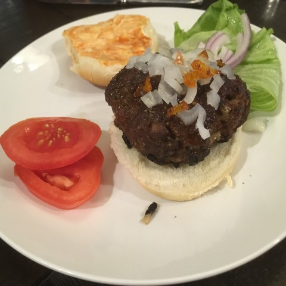
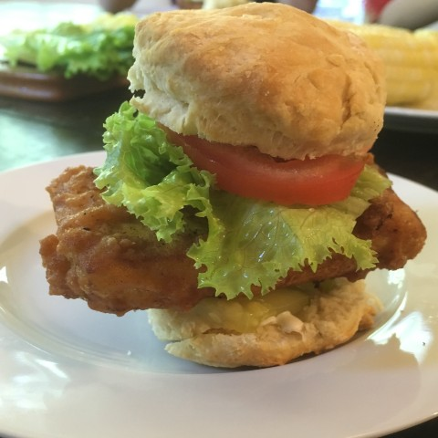
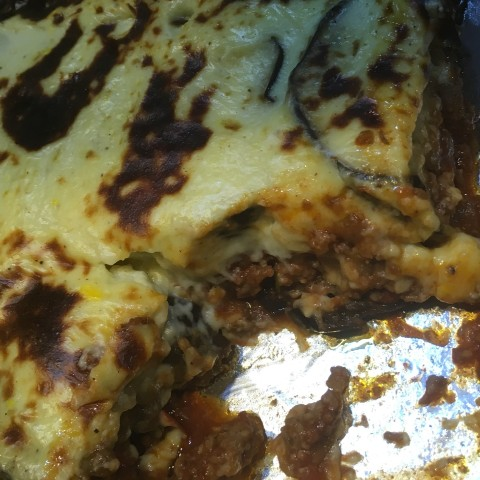

# Other Savory Dishes {.unnumbered}

## American {.unnumbered}

Ribs

### Falafel burgers {.unnumbered #burger}

{width=40%}

A wonderfull, juicy burger with half the meat.

 

:::: {.blackbox data-latex=""}

**Ingredients** (4-5 servings)

::: {}

- 2/3 cup powdered falafel mix
- 1/4 cup water
- 1/2 onion
- 1/4 cup breadcrumbs
- 1 egg
- 1 lb ground beef

:::

::::

 

### Hot chicken {.unnumbered #hotchicken}

{width=40%}

### Hot chicken-fried tofu {.unnumbered #hottofu}

{width=40%}

Home fries

Kale salad

Air-fried fish and chips

BBQ chicken pizza

Creamy tomato soup

Butternut squash mac and cheese

Pasta salad with olives

Biscuits and gravy

Corn chowder

Pulled meat

## Indian {.unnumbered}

Saag paneer

Sahi korma

Peas palag paneer

Pakoras

Tandori Chicken

Chicken korma

## European {.unnumbered}

### Moussaka {.unnumbered #moussaka}

{width=40%}

Spinach and beef lasagna

Pasta primavera

Gazpacho

Tabouli

Baba ganoush

Marinated tomatoes and cucumbers

Caldo Verde

Yorkshire Pudding with Beef and Mushrooms

## Middle Eastern and African {.unnumbered}

Kefta

Doro Wat

Kabobs

# Latin American {.unnumbered}

Tamales

Papusas

Picadillo

