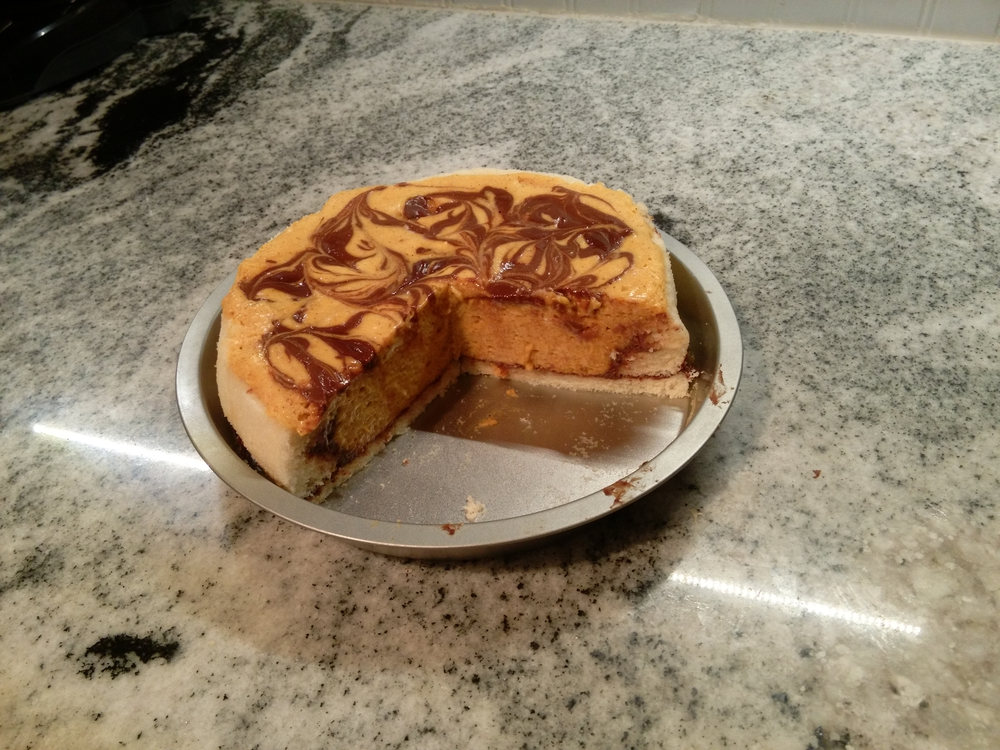

# Breads and Desserts {.unnumbered}

## Bread {.unnumbered}

### Crusty bread {.unnumbered #crustybread}

{width=80%}

Milk bread (for buns)

### Monkey bread {.unnumbered #monkey}

Naan

Pizza dough

Beer bread

Dinner rolls

Donuts

French breakfast puffs

## Desserts {.unnumbered}

### Creamy cheesecake {.unnumbered #cheesecake}

Delicious, creamy, cheesecake with more protien and less fat. 'Nough said.

::::{.blackbox data-latex=""}

- 2 packages **greek** cream cheese *(I find this has better flavor, texture, and mouthfeel than Neufatchel cheese and like it just as much, if not more than, full fat cream cheese.)*
- 1 cup heavy cream
- 1 cup sugar
- 3 eggs
- 1 tbsp vanilla
- 1/4 tsp salt

::::

Beat cream cheese and sugar until well mixed and cream cheese is soft and fluffy. Add eggs and salt and mix until fully incorporated. Add cream and vanilla and blend until smooth. Pour into a 12 inch nonstick springform pan with a prebaked shortbread or crumb crust. Bake at 300 for ~45 minutes. Let cool completely before serving. Fantastic with warm rhubarb or plum compote.

### Rhubarb pie {.unnumbered}

White bean paste buns

### Pumpkin mousse cake {.unnumbered #pumpkincake}

{width=80%}

Crepes

Leftover jam

Leftover galletes

Lemon merengue pie

