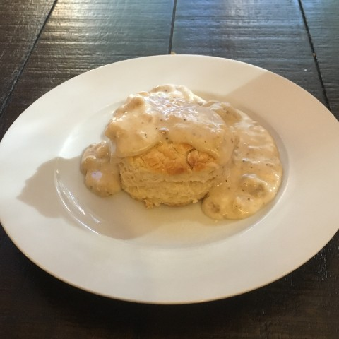

# Breads and Desserts {.unnumbered}

## Bread {.unnumbered}

### Crusty bread {.unnumbered #crustybread}

{width=40%}

It's all about that crispy, crunchy crust! Replace the water with beer for a nice, mild beer flavor.

 

::::: {.blackbox data-latex=""}

**Ingredients** (6-8 servings)

:::: {style="display: grid; grid-template-columns: 90%; grid-column-gap: 10px;"}
::: {}
- 4 cups bread flour
- 1.5 tsp salt
- 2-3 tsp yeast
- 2 tbsp gluten
- 2.5-3 cups water (or beer)
:::
::::
:::::

 

1. Dissolve the yeast in 1 cup of the water (lukewarm).

2. Mix all ingredients together in a stand mixer until the dough is smooth and elastic.

3. Let rest in an oiled container overnight or at least until doubled in size.

4. Gently shape into a round, trying to retain as many air holes as possible. Place on a baking tray dusted with semolina flour. Cover with a towel or plastic wrap so it doesn't dry out and let rise for ~45 minutes. Meanwhile, preheat the over to 500$^\circ$.

5. Bake at 500$^\circ$ for ~25 minutes. Pour 1 cup of hot water into the bottom of the oven when placing the bread in the oven. Do not open the oven door for at least 15 minutes to allow the steam from the water to help create the crispy crust.

### Mira's Biscuits (and gravy) {- #biscuits}

{width=40%}

This is my 9 year old daughter's go-to recipe for biscuits. A greater starter recipe for novice bakers.

::::: {.blackbox data-latex=""}

**Ingredients** (~12 biscuits)

:::: {style="display: grid; grid-template-columns: 90%; grid-column-gap: 10px;"}
::: {}

- 2 cups self-rising flour
- 1/3 cup shortening
- 1 cup milk or buttermilk

:::
::::
:::::

1. Preheat the oven to 400$^\circ$ then cut the shortening into the flour using a fork or pastry blender until you are getting close to the texture of (very) rough cornmeal. 

2. Make a well in the center and add the milk.

3. Fold the flour into the milk until the dough just barely holds together then turn out onto a lightly floured surface. (Do not overwork the mixture or your biscuits will be tough and chewy.)

4. Lightly roll out the dough to a ~1 inch thickness then cut out using a round biscuit or cookie cutter. (For extra layers of flake I like to do a quick book fold before cutting out the biscuits.)

5. Bake for ~15 minutes until golden brown.

*****

### Snail Rolls {.unnumbered #snail rolls}

{width=40%}

A slightly sweet, low fat, milk bread roll. Great for breakfast or dessert.

### Japanese milk bread (for filled buns) {.unnumbered #anpan}

{width=40%}

The bread used to make the delicous BBQ pork buns shown above. Great for sweet filled buns as well as savory.

::::: {.blackbox data-latex=""}

**Ingredients** (~16 rolls)

:::: {style="display: grid; grid-template-columns: 90%; grid-column-gap: 10px;"}
::: {}
- 2.5 cups plus 1 tbsp bread flour
- 1/2 cups all-purpose flour
- 1/4 cup sugar
- 2/3 tsp salt
- 2 tsp yeast
- 1 cup milk (slightly warmed)
- 4 tbsp butter (softened)
:::
::::
:::::

 

1. Combine 2 tsp yeast, 1/4 sugar and 3/4 cup milk in a small mixing bowl and let sit for 10 min as yeast dissolves.

2. In a microwavable bowl combine 1 tbsp of bread flour with the remaining 1/4 cup of milk.

3. Make a tangzhou paste by microwaving the milk and flour mixture for 1 minute then stirring. If the paste is not thick and smooth (like over-mixed instant masked potatoes) microwave an additional 30 seconds then stir. Repeat as neccessary until you achieve the desired consistency.

4. In the bowl of a stand mixer combine 2.5 cups bread flour, 1/2 cup all-purpose flour, and 2/3 tsp salt.

5. Add the wet ingredients and the tangzhou paste to the stand mixer and mix/knead for ~5 minutes.

6. While the mixer is running, gradually add small pieces of the softened butter and mix until the dough is smooth and elastic and the butter is fully incorporated.

6. Let rest in an oiled container about 1 hour or until doubled in size.

7. Divide dough into 16 equal pieces and gently knead each into a small ball. On a lightly floured surface roll or press each ball into a circle ~3-4 inches in diameter.

8. Place filing in the center of a circle of dough and gently pull sides of dough circle until they meet and pinch shut.

9. Place filled rolls seam side down on a baking tray and cover with a towel or plastic wrap so it doesn't dry out. Let rise for ~45 minutes. 

10. Preheat the over to 350$^\circ$. 

5. Bake rolls at 350$^\circ$ for ~15 minutes until golden brown. For a nice shiny glaze brush the rolls with an eggwash after 10 minutes in the over.

### Monkey bread {.unnumbered #monkey}

<!--Naan

Pizza dough

Beer bread

Dinner rolls

Donuts -->

### French breakfast puffs {- #frenchpuffs}

A Nelson family Christmas morning tradition since the 1970s.

::::: {.blackbox data-latex=""}

**Ingredients** (~16 rolls)

:::: {style="display: grid; grid-template-columns: 90%; grid-column-gap: 10px;"}
::: {}

- 3 cups all-purpose flour
- 3 teaspoons baking powder
- 1 teaspoon salt
- 1/2 teaspoon ground nutmeg
- 1 cup sugar
- 2/3 cup shortening
- 2 eggs
- 1 cup whole milk
- 1/2 pound (2 sticks) butter
- 1 1/2 cups sugar
- 3 teaspoons ground cinnamon

:::
::::
:::::

1. Preheat the oven to 350 degrees F. Lightly grease 12 muffin cups. In a large bowl, stir together the flour, baking powder, salt and nutmeg. Set aside.

2. In a separate large bowl, cream together the sugar and shortening. Add the eggs and mix again. Alternate adding one-third of the flour mixture and one-third of the milk to the creamed mixture, beating well after each addition.

3. Fill the muffin cups two-thirds full. Bake until golden, 20 to 25 minutes. Remove the muffins from the pan and set aside.

4. To make the coating, melt the butter in a bowl in the microwave. In a separate container, combine the sugar and cinnamon.

5. Dip the (entire) warm muffins in the butter, then roll in the cinnamon-sugar mixture.

## Desserts {.unnumbered}

### Creamy cheesecake {.unnumbered #cheesecake}

Delicious, creamy, cheesecake with more protien and less fat. 'Nough said.

::::{.blackbox data-latex=""}

- 2 packages **greek** cream cheese *(I find this has better flavor, texture, and mouthfeel than Neufatchel cheese and like it just as much, if not more than, full fat cream cheese.)*
- 1 cup heavy cream
- 1 cup sugar
- 3 eggs
- 1 tbsp vanilla
- 1/4 tsp salt

::::

Beat cream cheese and sugar until well mixed and cream cheese is soft and fluffy. Add eggs and salt and mix until fully incorporated. Add cream and vanilla and blend until smooth. Pour into a 12 inch nonstick springform pan with a prebaked shortbread or crumb crust. Bake at 300 for ~45 minutes. Let cool completely before serving. Fantastic with warm rhubarb or plum compote.

### Rhubarb pie {.unnumbered}

White bean paste buns

### Pumpkin mousse cake {.unnumbered #pumpkincake}

{width=40%}

Crepes

Leftover jam

Leftover galletes

Lemon merengue pie

