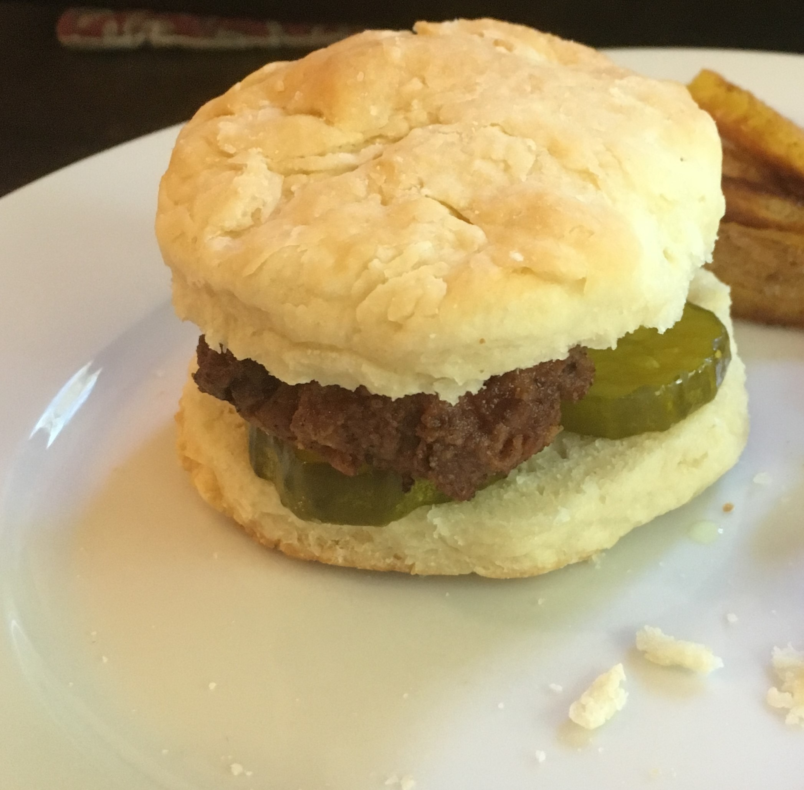
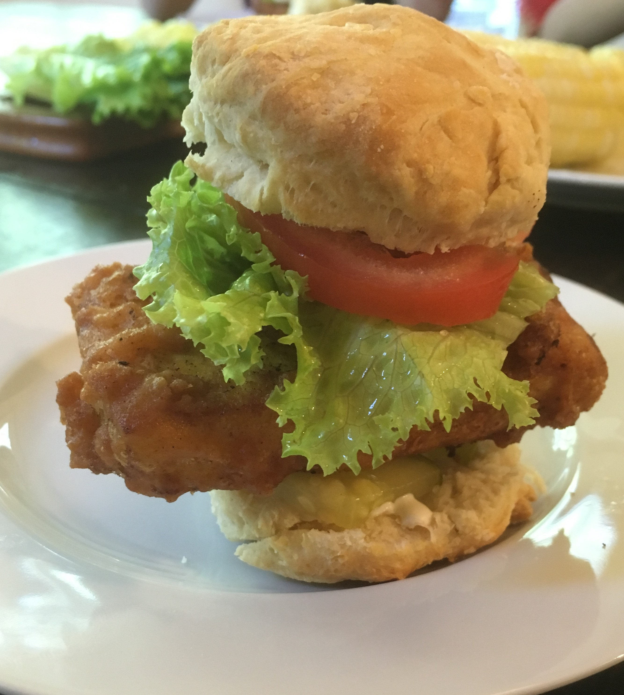
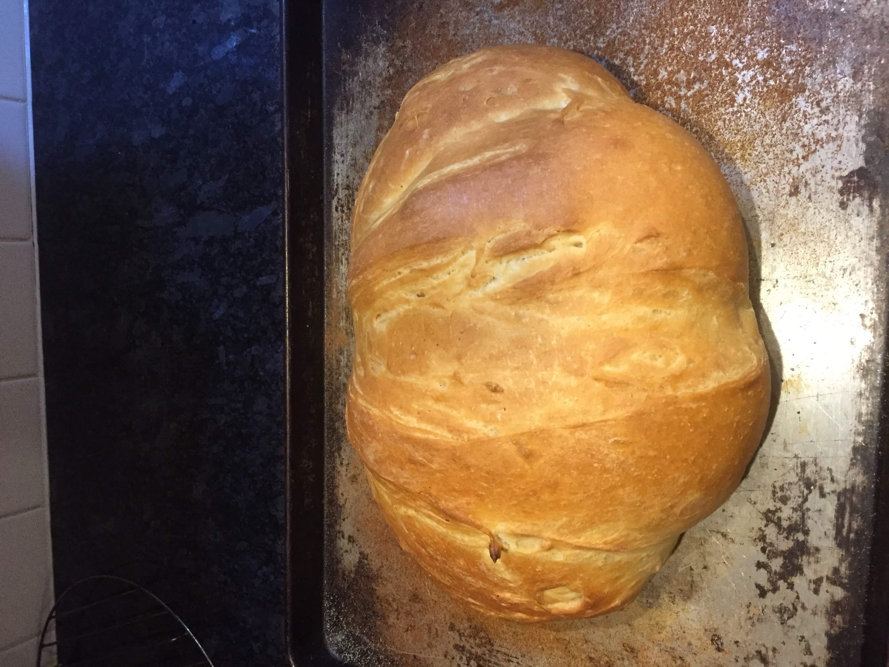
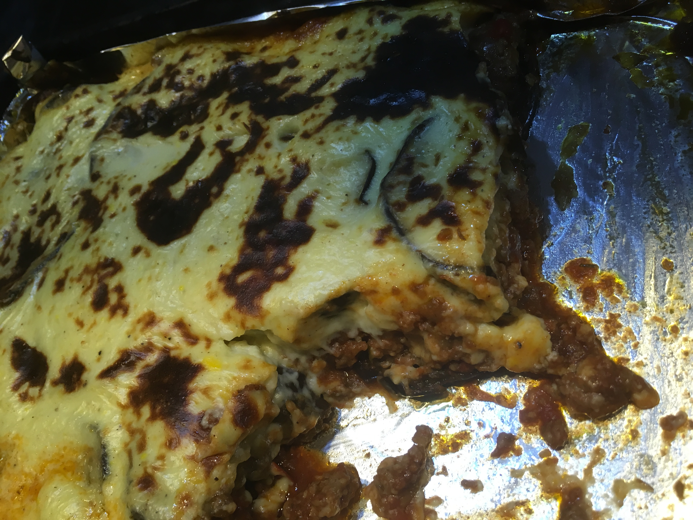
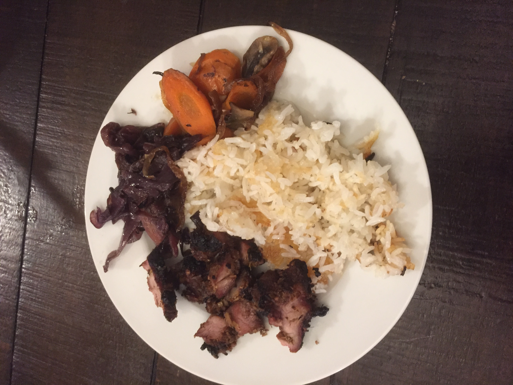

--- 
title: "InspiRed Home Cooking"
author: "Kate Nelson"
date: "`r Sys.Date()`"
site: bookdown::bookdown_site
output: bookdown::gitbook
documentclass: book
bibliography: [book.bib, packages.bib]
biblio-style: apalike
link-citations: yes
#github-repo: rstudio/bookdown-demo
description: "This is a literal cookbook made using markdown in R with recipes you can actually eat."
---

# A Literal Cookbook made using R Bookdown

This is a cookbook made in R. Yes, a literal cookbook. Not one of those "Cookbook for R" types with "recipes" for R code to do fun stuff with data. This cookbook has recipes that you will actually want to whip up in your kitchen and consume to nourish your body. Why make this in R you ask. Why not? I enjoy R (it clearly has invaded all aspects of my life) and it was an amusing way to learn the `Bookdown` package.

Let's build a picture-based TOC. 

<!--  Use nested CSS <div> containers notated using colons per [these directions](https://bookdown.org/yihui/rmarkdown-cookbook/multi-column.html) and cross-referencing per [these instructions](https://bookdown.org/yihui/rmarkdown-cookbook/cross-ref.html). -->


:::: {style="display: grid; grid-template-columns: 33% 33% 33%; grid-column-gap: 10px;"} 

::: {}
<center>
[{width=200, height=200}](#bbq)
[BBQ pork buns](#bbq)
</center>
:::

::: {}
<center>
[{width=200, height=200}](#botchien)
[Bot chien](#botchien)
</center>
:::

::: {}
<center>
[{width=200, height=200}](#hotchicken)
[Hot Chicken](#hotchicken)
</center>
:::

::: {}
<center>
[{width=200, height=200}](#hottofu)
[Hot-chicken-fried tofu](#hottofu)
</center>
:::

::: {}
<center>
[{width=200, height=200}](#bohue)
[Bun bo hue](#bohue)
</center>
:::

::: {}
<center>
[{width=200, height=200}](#crustybread)
[Crusty bread](#crustybread)
</center>
:::

::: {}
<center>
[{width=200, height=200}](#moussaka)
[Moussaka](#moussaka)
</center>
:::

::: {}
<center>
[{width=200, height=200}](#crispyrice)
[Crispy Rice](#crispyrice)
</center>
:::

::::


<!-- removing section numbering for recipe sub-headers see [this](https://bookdown.org/yihui/rmarkdown-cookbook/unnumbered-sections.html). -->

```{r include=FALSE}
# automatically create a bib database for R packages
knitr::write_bib(c(
  .packages(), 'bookdown', 'knitr', 'rmarkdown'
), 'packages.bib')
```
