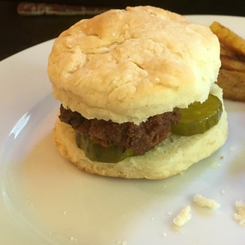
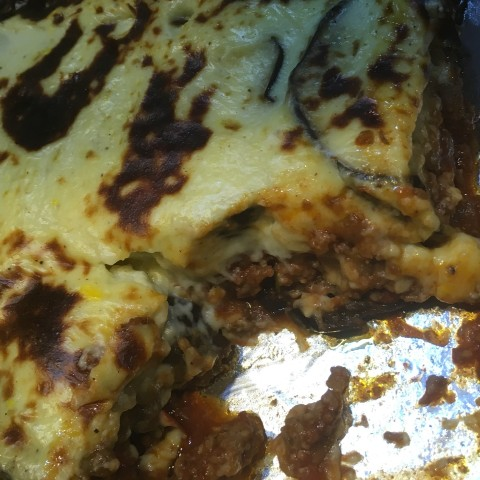
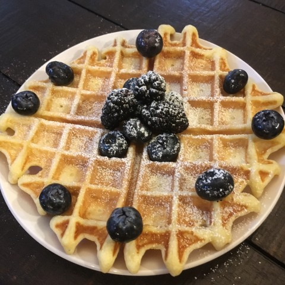
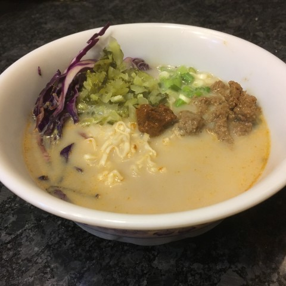
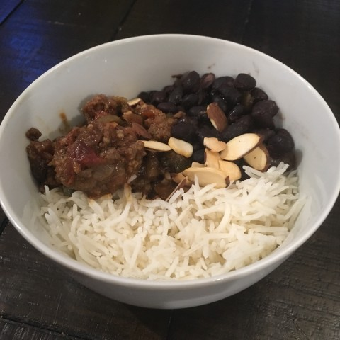

--- 
title: "InspiRed Home Cooking"
author: "Kate Nelson"
date: "`r Sys.Date()`"
site: bookdown::bookdown_site
output: bookdown::gitbook
documentclass: book
bibliography: [book.bib, packages.bib]
biblio-style: apalike
link-citations: yes
#github-repo: rstudio/bookdown-demo
description: "This is a literal cookbook made using markdown in R with recipes you can actually eat."
---

# Intro {.unnumbered}

This is a cookbook made in R. Yes, a literal cookbook. Not one of those "Cookbook for R" types with "recipes" for R code to do fun stuff with data. This cookbook has recipes that you will actually want to whip up in your kitchen and consume to nourish your body. Why make this in R you ask. Why not? I enjoy R (it clearly has invaded all aspects of my life) and it was an amusing way to learn the `Bookdown` package.


<!--  Use nested CSS <div> containers notated using colons per [these directions](https://bookdown.org/yihui/rmarkdown-cookbook/multi-column.html) and cross-referencing per [these instructions](https://bookdown.org/yihui/rmarkdown-cookbook/cross-ref.html). -->

:::: {style="display: grid; grid-template-columns: 24% 24% 24% 24%; grid-column-gap: 10px;
grid-row-gap: 10px;"} 

::: {}
<center>
[{width=100%}](#botchien)
[Bot chien](#botchien)
</center>
:::

::: {}
<center>
[{width=100%}](#bohue)
[Bun bo hue](#bohue)
</center>
:::

::: {}
<center>
[{width=100%}](#hutieu)
[Hu Tieu](#hutieu)
</center>
:::

::: {}
<center>
[{width=100%}](#banhxeo)
[Banh Xeo](#banhxeo)
</center>
:::

::: {}
<center>
[{width=100%}](#banhmi)
[Banh Mi](#banhmi)
</center>
:::

::: {}
<center>
[{width=100%}](#burger)
[Falafel Burger](#burger)
</center>
:::

::: {}
<center>
[{width=100%}](#saag)
[Saag Paneer](#saag)
</center>
:::

::: {}
<center>
[{width=100%}](#bbq)
[BBQ pork buns](#bbq)
</center>
:::

::: {}
<center>
[{width=100%}](#hotchicken)
[Hot Chicken](#hotchicken)
</center>
:::

::: {}
<center>
[{width=100%}](#hottofu)
[Hot-chicken-fried tofu](#hottofu)
</center>
:::

::: {}
<center>
[{width=100%}](#crustybread)
[Crusty bread](#crustybread)
</center>
:::

::: {}
<center>
[{width=100%}](#moussaka)
[Moussaka](#moussaka)
</center>
:::

::: {}
<center>
[{width=100%}](#crispyrice)
[Crispy Rice](#crispyrice)
</center>
:::

::: {}
<center>
[{width=100%}](#gingerfish)
[Ginger Fish](#gingerfish)
</center>
:::

::: {}
<center>
[{width=100%}](#pumpkincake)
[Pumpkin Mousse Cake](#pumpkincake)
</center>
:::

::: {}
<center>
[{width=100%}](#snailroll)
[Snail Rolls](#snailroll)
</center>
:::

::: {}
<center>
[{width=100%}](#cheesecake)
[Creamy Cheesecake](#cheesecake)
</center>
:::

::: {}
<center>
[{width=100%}](#cornchowder)
[Corn Chowder](#cornchowder)
</center>
:::

::: {}
<center>
[{width=100%}](#squashmc)
[Butternut Squash Mac and Cheese](#squashmc)
</center>
:::

::: {}
<center>
[{width=100%}](#fishandchips)
[Air-fried Fish and Chips](#fishandchips)
</center>
:::


::: {}
<center>
[{width=100%}](#bicuits)
[Biscuits and Gravy](#biscuits)
</center>
:::

::: {}
<center>
[{width=100%}](#waffles)
[Waffles](#waffles)
</center>
:::

::: {}
<center>
[{width=100%}](#eggplantparm)
[Eggplant Parmesan](#eggplantparm)
</center>
:::

::: {}
<center>
[{width=100%}](#tatamen)
[Tatamen Spicy Ramen](#tatamen)
</center>
:::

::: {}
<center>
[{width=100%}](#papusas)
[Papusas](#papusas)
</center>
:::

::: {}
<center>
[{width=100%}](#picadillo)
[Picadillo](#picadillo)
</center>
:::

::::


<!-- removing section numbering for recipe sub-headers see [this](https://bookdown.org/yihui/rmarkdown-cookbook/unnumbered-sections.html). -->

```{r include=FALSE}
# automatically create a bib database for R packages
knitr::write_bib(c(
  .packages(), 'bookdown', 'knitr', 'rmarkdown'
), 'packages.bib')
```
